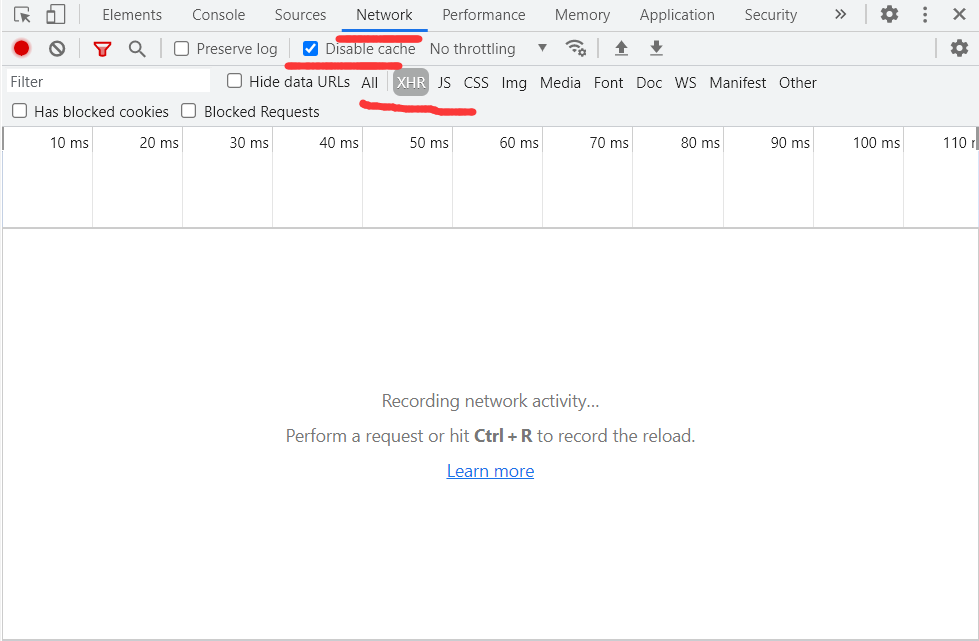
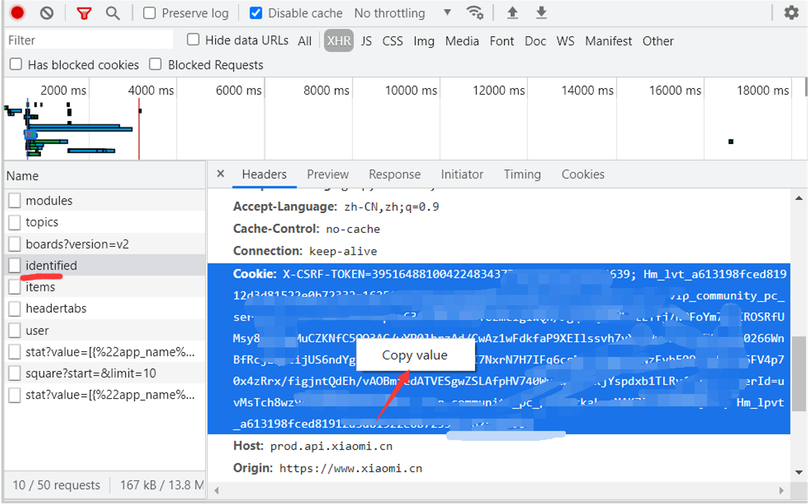
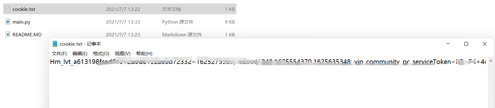
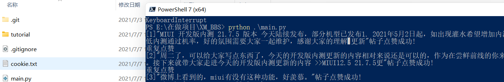

# 小米社区自动点赞

### 可以干什么大家都很清楚，我们就混个内测分

# 本项目仅供学习交流使用，请不要利用信息不对称来赚钱

# 不建议小白使用，不建议小白使用，不建议小白使用

### 用法

- 电脑浏览器打开并登录小米社区
- 登陆后按F12，打开Network选项，按我截图的勾选
- 
- 勾选好后F5刷新
- 随便点开一个请求，右击复制Headers中的cookie
- 
- 在代码同级目录新建一个文件cookie.txt,内容为你刚才复制的cookie
- 
- 运行main.py ,安装python(添加到PATH)后在代码根目录打开命令行(windows shift+右击打开powershell 或打开cmd)，输入python3 main.py
- 
- 如果报错,请输入pip3 install requests 安装requests
- 如果你还看不懂，建议你不要使用了...
- 使用风险自担，比如自动复制了不当言论被禁言....
- 给颗star支持下吧
- 注:如果你不想自动复制热评回复，请把main.py中第11行的True改为False再运行